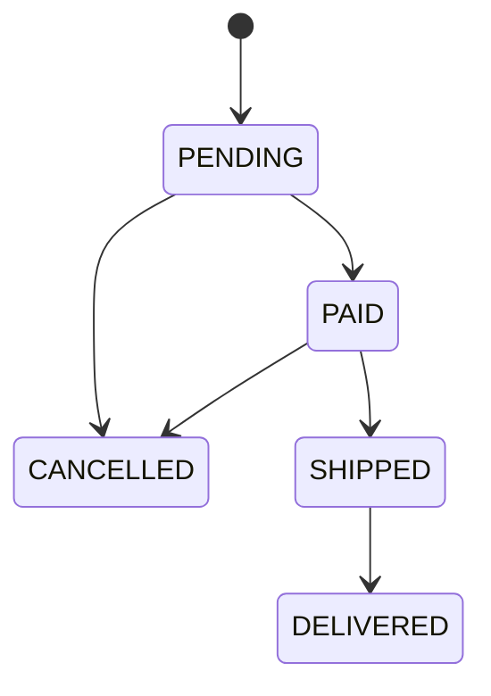

# Storing Enums in the Database: @Enumerated, Postgres Enum Types, and Lookup Tables

Almost every domain model has a field that can only hold one of a handful of values. An order is
`PENDING`, `PAID`, `SHIPPED`, `DELIVERED`, or `CANCELLED`. A payment is authorized or captured. A
subscription is on one of four plans. In Java you reach for an `enum` without thinking. The
interesting question is what happens at the boundary — **how that finite set of values actually
lives in the database**, and what each option costs you six months later when the set changes.

This article walks through every common way to persist an enum with Hibernate, in the order you'd
actually meet them: the two `@Enumerated` modes, a real Postgres `ENUM` type, an
`AttributeConverter`, and finally the lookup-table approach where the enum becomes its own table.
I'll evolve a single example — an order's status — the whole way through, and end with the choice
I actually make.

Stack: **Java, Spring Boot, Hibernate, PostgreSQL**.

<div class="post-tldr" markdown="1">
<p class="post-tldr-title">TL;DR</p>

- `@Enumerated(ORDINAL)` stores the enum's **position** — compact, but inserting a value in the middle silently corrupts every later row. If you must use it, **pin the ordinals with a unit test**.
- `@Enumerated(STRING)` stores the **constant name** — self-describing, debuggable, immune to reordering. This is the sane default.
- Don't settle for a bare `varchar` — define a real **Postgres `ENUM` type** so the database itself rejects invalid values.
- An **`AttributeConverter`** persists a stable code decoupled from the Java name, so **renames stop being a database problem**.
- A **lookup table** is worth it only when the values carry editable business data — not as a workaround for renames.
</div>

---

## The Scenario

We're building order management. An order moves through a fixed lifecycle:



In Java that's an obvious enum:

```java
public enum OrderStatus {
    PENDING,
    PAID,
    SHIPPED,
    DELIVERED,
    CANCELLED
}
```

The order entity has a `status` field. The only question is how Hibernate maps it to a column —
and that single annotation choice has consequences that outlive the code you write today.

---

## Part 1 — `@Enumerated(ORDINAL)`: Store as Int

JPA's default for an enum is `ORDINAL`. Each constant is stored as its position in the
declaration: `PENDING` → 0, `PAID` → 1, `SHIPPED` → 2, and so on.

```java
@Entity
@Table(name = "orders_ordinal")
public class OrderOrdinal {

    @Id
    @GeneratedValue(strategy = GenerationType.UUID)
    private UUID id;

    @Enumerated(EnumType.ORDINAL)   // this is also the default if you omit @Enumerated
    @Column(nullable = false)
    private OrderStatus status;
}
```

```sql
CREATE TABLE orders_ordinal (
    id     UUID     PRIMARY KEY DEFAULT gen_random_uuid(),
    status SMALLINT NOT NULL
);
```

Save an order with status `PAID` and the column holds `1`. It's compact, and on paper it's fine.

### ❌ The Trap: Inserting a Value in the Middle

The ordinal isn't stored as a label — it's stored as a *position*, and the position is defined by
source-code order. The day someone adds a packing step between paid and shipped:

```java
public enum OrderStatus {
    PENDING,
    PAID,
    PACKED,      // <-- inserted here
    SHIPPED,
    DELIVERED,
    CANCELLED
}
```

…every constant after `PAID` shifts down by one:

| Constant | Ordinal before | Ordinal after |
|---|---|---|
| `PENDING`   | 0 | 0 |
| `PAID`      | 1 | 1 |
| `PACKED`    | — | **2** |
| `SHIPPED`   | 2 | **3** |
| `DELIVERED` | 3 | **4** |
| `CANCELLED` | 4 | **5** |

Nothing in the database changed. Every existing `SHIPPED` order still holds the integer `2` — but
`2` now decodes to `PACKED`. Shipped orders silently become packed. Delivered becomes shipped.
There's no error, no failed migration, no log line. The data didn't move; your interpretation of
it did. You find out when a customer asks why their delivered order says it's being packed.

### The Guard: Pin the Ordinals

If you have a reason to keep `ORDINAL` — a legacy schema, a genuinely hot, huge table where the
byte difference matters — then make the ordering load-bearing *explicitly*, with a test that fails
the moment anyone reorders the enum:

```java
class OrdinalPinTest {

    @Test
    void ordinalsAreFrozen() {
        // If this test fails, you reordered OrderStatus. Existing ORDINAL-mapped rows now mean
        // something different. Revert the reorder, or append the new value at the end.
        assertThat(OrderStatus.PENDING.ordinal()).isZero();
        assertThat(OrderStatus.PAID.ordinal()).isEqualTo(1);
        assertThat(OrderStatus.SHIPPED.ordinal()).isEqualTo(2);
        assertThat(OrderStatus.DELIVERED.ordinal()).isEqualTo(3);
        assertThat(OrderStatus.CANCELLED.ordinal()).isEqualTo(4);
        assertThat(OrderStatus.values()).hasSize(5);
    }
}
```

It's a pure unit test — no Spring context, no database. It turns an invisible data-corruption bug
into a red build the instant someone touches the enum. New values are still allowed; they just
have to go at the end, where appending is safe. That's the whole rule `ORDINAL` quietly depends
on, written down.

---

## Part 2 — `@Enumerated(STRING)`: Store as Varchar

The fix for almost everyone is one word:

```java
@Enumerated(EnumType.STRING)
@Column(nullable = false)
private OrderStatus status;
```

Now the column stores the constant *name*:

```sql
CREATE TABLE orders_string (
    id     UUID    PRIMARY KEY DEFAULT gen_random_uuid(),
    status VARCHAR NOT NULL
);
```

A `PAID` order stores the literal string `'PAID'`. Three things get better immediately:

- **Reordering is harmless.** The value is its own name; positions don't matter anymore. Add
  `PACKED` wherever you like.
- **It's debuggable.** `SELECT * FROM orders_string WHERE status = 'PAID'` reads like English. No
  decoder ring, no joining against your Java source in your head.
- **Dumps and logs are self-describing.** A row in a CSV export means something on its own.

Yes, `'DELIVERED'` costs more bytes than `3`. For the overwhelming majority of tables that
difference is noise — and you can always add an index. Storing the name is the right default, and
"compact" is almost never worth "silently wrong."

### The One Remaining Trap: Renames

`STRING` removes the ordering trap but introduces a smaller one. The stored value *is* the Java
identifier, so renaming the constant orphans existing rows:

```java
PENDING  →  AWAITING_PAYMENT
```

Every old `'PENDING'` row no longer matches any constant, and Hibernate throws when it reads one
back. The stored data and the code have silently drifted apart. You can fix this with a data
migration (`UPDATE … SET status = 'AWAITING_PAYMENT' WHERE status = 'PENDING'`) — and that's a
perfectly fine answer. We'll also see a way to make renames a non-event entirely in Part 4.

---

## Part 3 — Good Style: A Real Postgres Enum Type

Both options above store into a column the database doesn't really understand — a `smallint` or a
`varchar` that *happens* to hold enum values. Postgres can do better. It has first-class enum
types:

```sql
CREATE TYPE order_status AS ENUM ('PENDING', 'PAID', 'SHIPPED', 'DELIVERED', 'CANCELLED');

CREATE TABLE orders_pgenum (
    id     UUID         PRIMARY KEY DEFAULT gen_random_uuid(),
    status order_status NOT NULL
);
```

Now the *database* enforces the domain. An `INSERT … VALUES ('SHPPED')` — a typo, a bad migration,
a rogue script — fails at the source with `invalid input value for enum order_status`. With a bare
`varchar`, that garbage lands in the table and you discover it later. The enum type is
documentation and a constraint in one: the column's type literally lists its legal values.

Mapping it in Hibernate is the same `@Enumerated(STRING)` as before — Hibernate binds the constant
name as a string and Postgres stores it in the enum:

```java
@Enumerated(EnumType.STRING)
@Column(nullable = false, columnDefinition = "order_status")
private OrderStatus status;
```

There's exactly one piece of plumbing. By default the PostgreSQL JDBC driver sends a Java `String`
as type `varchar`, and Postgres will not implicitly cast `varchar` → `order_status`, so you'd get
`column "status" is of type order_status but expression is of type character varying`. Add
`stringtype=unspecified` to the JDBC URL and the driver sends the value as `unknown`, letting
Postgres cast it to the enum:

```yaml
spring:
  datasource:
    url: jdbc:postgresql://localhost:5434/mydatabase?stringtype=unspecified
```

(Hibernate 6 also offers `@JdbcTypeCode(SqlTypes.NAMED_ENUM)` to target a named enum type directly;
the `@Enumerated(STRING)` + `stringtype=unspecified` combination above is the most common and the
one I reach for.)

**The one caveat to know:** `ALTER TYPE order_status ADD VALUE 'PACKED'` only ever *appends*. You
can add a value (and since PostgreSQL 12, even before/after a specific one), but you can't drop or
reorder existing values without recreating the type. That sounds limiting until you realize it's
the *same rule* the ordinal test enforced — never reorder, only add — except here the database
guarantees it instead of a unit test. The constraint is the feature.

---

## Part 4 — `AttributeConverter`: Decouple the Name From the Value

The rename trap from Part 2 exists because we let the *stored value* and the *Java identifier* be
the same string. A JPA `AttributeConverter` breaks that coupling: you persist a stable code that
has nothing to do with the constant's name.

Give each constant an explicit, permanent code:

```java
public enum OrderStatus {

    PENDING("PND"),
    PAID("PAID"),
    SHIPPED("SHP"),
    DELIVERED("DLV"),
    CANCELLED("CNC");

    private final String code;

    OrderStatus(String code) {
        this.code = code;
    }

    public String getCode() {
        return code;
    }

    public static OrderStatus fromCode(String code) {
        return Arrays.stream(values())
                .filter(s -> s.code.equals(code))
                .findFirst()
                .orElseThrow(() -> new IllegalArgumentException("Unknown OrderStatus code: " + code));
    }
}
```

Then a converter that maps enum ↔ code:

```java
@Converter
public class OrderStatusConverter implements AttributeConverter<OrderStatus, String> {

    @Override
    public String convertToDatabaseColumn(OrderStatus status) {
        return status == null ? null : status.getCode();
    }

    @Override
    public OrderStatus convertToEntityAttribute(String code) {
        return code == null ? null : OrderStatus.fromCode(code);
    }
}
```

And wire it on the field with `@Convert` instead of `@Enumerated`:

```java
@Convert(converter = OrderStatusConverter.class)
@Column(nullable = false)
private OrderStatus status;
```

Now the database stores `'PAID'` as a *code*, not as the identifier. Rename the Java constant
`PENDING` to `AWAITING_PAYMENT` and the stored code `'PND'` never changes — the rename is a pure
refactor with zero database impact. You've decoupled what the database knows from what you call
things in code, which is exactly the property people reach for lookup tables to get. Keep this in
mind for the next part.

---

## Part 5 — The Lookup-Table Approach

The last approach stops treating the status as an enum at all. Instead, the set of statuses lives
in its own table, and orders reference a row by foreign key:

```sql
CREATE TABLE order_statuses (
    id       INTEGER PRIMARY KEY,
    code     VARCHAR NOT NULL UNIQUE,
    label    VARCHAR NOT NULL,
    terminal BOOLEAN NOT NULL DEFAULT FALSE
);

INSERT INTO order_statuses (id, code, label, terminal) VALUES
    (1, 'PND',  'Pending',   FALSE),
    (2, 'PAID', 'Paid',      FALSE),
    (3, 'SHP',  'Shipped',   FALSE),
    (4, 'DLV',  'Delivered', TRUE),
    (5, 'CNC',  'Cancelled', TRUE);

CREATE TABLE orders_lookup (
    id        UUID    PRIMARY KEY DEFAULT gen_random_uuid(),
    status_id INTEGER NOT NULL REFERENCES order_statuses (id)
);
```

In JPA the status becomes a relationship, not an enumerated value:

```java
@Entity
@Table(name = "orders_lookup")
public class OrderLookup {

    @Id
    @GeneratedValue(strategy = GenerationType.UUID)
    private UUID id;

    @ManyToOne(fetch = FetchType.EAGER, optional = false)
    @JoinColumn(name = "status_id", nullable = false)
    private OrderStatusDefinition status;
}
```

To know what status an order has — its human label, whether it's terminal — you **join**:

```sql
SELECT o.id, s.code, s.label
FROM   orders_lookup o
JOIN   order_statuses s ON s.id = o.status_id
WHERE  o.id = ?;
```

### ✅ When This Earns Its Keep

The lookup table buys one real thing: the set of values, and the metadata attached to each, lives
in **data** instead of in **code**. That's genuinely valuable when:

- **Each value carries editable business data** — a display label, a sort order, a color, a
  feature flag, an SLA. The status isn't just an identity; it's a little record.
- **Non-developers manage the values**, or they're configured per tenant, or they change at
  runtime without a deploy.
- **You have genuine mass changes** — rename a label that appears across millions of rows by
  updating one row in `order_statuses`, not every order.

That last point is the strongest argument: change one place, not all of them. If your "enum" is
really a maintained catalog, this is the right model.

---

## My Take

For a *plain* enum — a fixed set of code-level states like an order lifecycle — I don't use a
lookup table, and I'd push back on it in review.

The usual justification I hear is "what if we need to rename a value?" But we just saw that's
solved without a table: an `AttributeConverter` decouples the stored code from the Java name, and a
label that changes is a one-line migration. You don't need a foreign key and a join on every query
to survive a rename.

What the lookup table actually adds, for that case, is permanent cost: every read either joins or
carries a second query, the status is now a managed relationship instead of a value, and a
compile-time-exhaustive `switch` over your states becomes a runtime lookup that can miss. You've
traded a value your compiler understands for a row your compiler doesn't, to buy flexibility a
fixed lifecycle never uses.

So my rule is about **what the value is**, not about renames:

- If the value is **identity only** — it's `SHIPPED`, full stop — keep it an enum. Map it
  `@Enumerated(STRING)`, back it with a Postgres enum type, and reach for an `AttributeConverter`
  when you want renames to be free.
- If the value is **a record** — it has fields that get edited, by people, at runtime — then it
  was never really an enum. Give it a table.

Renaming is not the deciding factor. The deciding factor is whether the thing has data of its own.

---

## Decision Guide

| Approach | Stores | Use when | Main risk |
|---|---|---|---|
| `@Enumerated(ORDINAL)` | position (`1`) | almost never | reorder silently corrupts rows |
| `@Enumerated(STRING)` | constant name (`'PAID'`) | the sane default | renames orphan rows |
| Postgres `ENUM` type | name, DB-validated | you want the DB to reject bad values | `ADD VALUE` only appends |
| `AttributeConverter` | stable code (`'PAID'`) | you want renames to be free | one small class to maintain |
| Lookup table | FK to a row | values carry editable data | a join on every read |

A solid default for most projects: **`@Enumerated(STRING)` over a Postgres enum type**, upgrading
to an **`AttributeConverter`** the moment you want the stored value insulated from the Java name.

---

## Code

Code from this article is available at
**[github.com/javaAndScriptDeveloper/enums-article](https://github.com/javaAndScriptDeveloper/enums-article)** —
the same `OrderStatus` enum persisted all five ways, the ordinal-pinning test, and a round-trip
test per approach that asserts what each one actually writes to disk. Everything runs locally with
Docker and a single `./gradlew test`.

---

## Final Thoughts

Picking how to store an enum feels like a five-second decision, and that's exactly why it's worth
slowing down for. The ordinal footgun, the rename trap, the missing database constraint — none of
them show up the day you write the annotation. They show up the day the set of values changes,
which it always does, usually long after you've forgotten the trade-off you made.

The good news is the defaults are easy: store the name, let the database validate it, and decouple
the code from the identifier when you need to. Save the lookup table for the cases that are
genuinely a catalog and not an enum. Get that right once and your statuses stay boring — which is
the highest compliment you can pay a column.

---

## Let's Talk

If you store enums differently — or you've been burned by one of these traps in a way I didn't
cover — I'd like to hear it. Contact links are in the footer.
