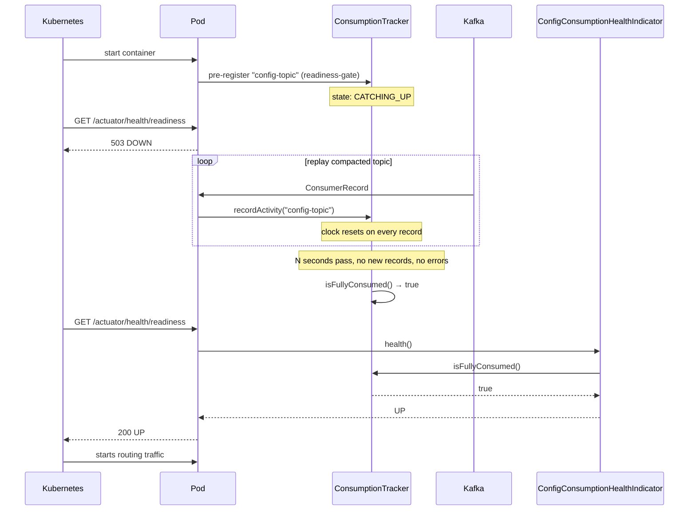
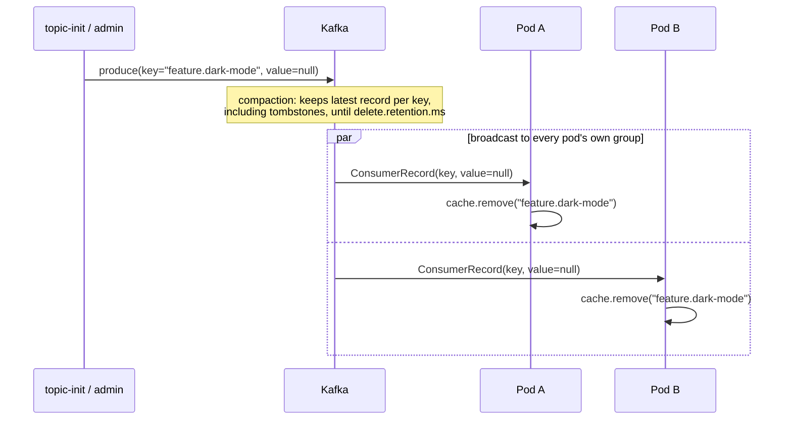

# Can Kafka Replace Redis for Cache Synchronization? A Production Answer

I spend a fair amount of time reading r/apachekafka, and a thread there recently asked a question
I've answered in production more than once:
**[Can Kafka Replace Redis for Cache Synchronization Across Multiple Spring Boot Pods?](https://www.reddit.com/r/apachekafka/comments/1vhv9nn/can_kafka_replace_redis_for_cache_synchronization/)**
I like these threads because they're honest about the messy middle — not "here's a pattern," but
"here's my actual architecture, here's what I'm worried about." I answered it there. This article
is the fuller version of that answer, with the code to back it up.

The original question, paraphrased:

> Spring Boot on GCP, ~25 pods, Redis currently handles cache synchronization. Considering Kafka
> instead: publish an event when a cache entry changes, every pod consumes it and updates its own
> local cache. Is Kafka a good fit here? With 25 pods, does every pod get the update, or does
> Kafka hand it to only one consumer? Does each pod need its own consumer group? Has anyone
> actually run this — what are the pros and cons?

We've run exactly this — a compacted topic feeding a local cache on every pod, one consumer group
per pod — in production for years. This is that pattern, the parts of it that are easy to get
wrong, and a full runnable example so you can see it working instead of taking my word for it.

<div class="post-tldr" markdown="1">
<p class="post-tldr-title">TL;DR</p>

- **Yes, with a caveat**: Kafka replaces Redis for *broadcasting* state to every pod, not for
  strongly-consistent shared reads. Each pod gets its own eventually-consistent local copy.
- **Every pod needs its own Kafka consumer group.** Pods sharing a group split the partitions
  (load-balanced); pods each in their own group each get the full topic (broadcast).
- The topic must be **compacted** and have **more than one partition**, so a single pod can
  consume it concurrently — and its local cache must be **thread-safe**.
- **Deletes are tombstones**: a record with a null value, not a special "delete" message type.
- **Gate readiness** on "no new messages, no errors, for N seconds" — don't serve traffic or run
  scheduled jobs off a half-replayed cache.
- You will accumulate **dead consumer groups**, one per pod that's ever existed. That's expected,
  not a leak.
</div>

---

## Why this isn't "just use a message queue"

The Reddit answer that got the most traction — mine — starts from a specific mechanism: the
config topic is **compacted**, and each pod consumes it into its **own local, in-memory cache**.
That's a different shape from the usual "publish an event, one handler processes it" queue
pattern, and the difference is the whole point.

```mermaid
graph TB
    subgraph "Shared consumer group — load-balanced (NOT what we want)"
        T1["Topic: local-cache-config<br/>(3 partitions)"]
        T1 -->|partition 0| A1["Pod A"]
        T1 -->|partition 1| B1["Pod B"]
        T1 -->|partition 2| C1["Pod C"]
        G1(["group: cache-consumers"]) -.shared by.- A1
        G1 -.shared by.- B1
        G1 -.shared by.- C1
    end

    subgraph "One group per pod — broadcast (what we want)"
        T2["Topic: local-cache-config<br/>(3 partitions)"]
        T2 -->|all 3 partitions| A2["Pod A<br/>local cache: 100% of keys"]
        T2 -->|all 3 partitions| B2["Pod B<br/>local cache: 100% of keys"]
        T2 -->|all 3 partitions| C2["Pod C<br/>local cache: 100% of keys"]
        GA(["group: local-cache-demo-uid-A"]) -.-. A2
        GB(["group: local-cache-demo-uid-B"]) -.-. B2
        GC(["group: local-cache-demo-uid-C"]) -.-. C2
    end
```

Kafka's consumer-group protocol only ever does one thing: **within a group, each partition goes to
exactly one member.** Whether that reads as "load balancing" or "broadcasting" is entirely a
function of how many groups you have:

- **One shared group across pods** → partitions split between them → each message reaches exactly
  one pod. That's what you want for a work queue. It's the wrong answer for a cache update.
- **One group per pod** → every group gets every partition → every message reaches every pod.
  That's the broadcast this article is about — and it directly answers the Reddit thread's second
  and third questions: no, Kafka doesn't hand the message to only one consumer *if you don't let
  it*, and yes, every pod needs its own group.

## Building it: a compacted topic → a local cache

The topic is created **compacted**, with more than one partition (so a single pod can consume it
concurrently), and it is never created or seeded by the application — a topic-init job does that
before any pod starts (more on that under [Try it yourself](#try-it-yourself)).

Consumer-side config, from `app/src/main/resources/application.yml` in the [example
repo](#code):

```yaml
app:
  config-topic: ${CONFIG_TOPIC:local-cache-config}
  kafka:
    bootstrap-servers: ${KAFKA_BOOTSTRAP_SERVERS:localhost:9092}
    # Broadcast, not load-balance: every pod gets its own group so it sees the whole topic.
    # CONSUMER_GROUP_PREFIX comes from a k8s ConfigMap; POD_UID from the Downward API
    # (metadata.uid) — see the app Deployment manifest under k8s/.
    consumer-group: ${CONSUMER_GROUP_PREFIX:local-cache-demo}-${POD_UID:local}
```

That answers the Reddit thread's third question directly: **`CONSUMER_GROUP_PREFIX` is the
ConfigMap-driven piece** (a human picks it, it's the same for every pod in a deployment);
**`POD_UID`** is Kubernetes' own Downward API, resolved from `metadata.uid` — free, automatic,
no sidecar or generated UUID needed. Spring's property placeholder resolution glues the two into
one `group-id` at startup, exactly like the original Reddit answer's `${random.uuid}`
env-var trick, minus the extra moving part.

At the time of writing, Spring Boot 4.1 doesn't ship Kafka autoconfiguration yet — no
`spring.kafka.*` binding — so the consumer factory is wired by hand:

```java
@EnableKafka
@Configuration
public class KafkaConfig {

    @Bean
    public ConsumerFactory<String, String> consumerFactory(
            @Value("${app.kafka.bootstrap-servers}") String bootstrapServers,
            @Value("${app.kafka.consumer-group}") String groupId) {
        Map<String, Object> props = Map.of(
                ConsumerConfig.BOOTSTRAP_SERVERS_CONFIG, bootstrapServers,
                ConsumerConfig.GROUP_ID_CONFIG, groupId,
                ConsumerConfig.KEY_DESERIALIZER_CLASS_CONFIG, StringDeserializer.class,
                ConsumerConfig.VALUE_DESERIALIZER_CLASS_CONFIG, StringDeserializer.class,
                // A brand-new consumer group has no committed offset, and every pod's group is
                // brand new — start from the beginning so each pod replays the full compacted
                // topic on every startup.
                ConsumerConfig.AUTO_OFFSET_RESET_CONFIG, "earliest");
        return new DefaultKafkaConsumerFactory<>(props);
    }

    @Bean
    public ConcurrentKafkaListenerContainerFactory<String, String> kafkaListenerContainerFactory(
            ConsumerFactory<String, String> consumerFactory) {
        var factory = new ConcurrentKafkaListenerContainerFactory<String, String>();
        factory.setConsumerFactory(consumerFactory);
        return factory;
    }
}
```

`earliest` matters more than it looks: because every pod's consumer group is unique and has never
committed an offset before, "earliest" is the *only* way a pod ever sees the full compacted
history. `latest` would mean a freshly started pod only sees updates from the moment it started —
an empty cache until the next unrelated change happens to come through.

The listener itself is small on purpose — it's the local cache and the tombstone check that carry
the logic:

```java
@Slf4j
@Component
@RequiredArgsConstructor
public class ConfigTopicListener {

    private final LocalConfigCache cache;

    @ConfigConsumer("config-topic")
    @KafkaListener(topics = "${app.config-topic}")
    public void onMessage(ConsumerRecord<String, String> record) {
        if (record.value() == null) {
            log.debug("Tombstone for key '{}' — evicting from local cache", record.key());
            cache.remove(record.key());
            return;
        }
        log.debug("Upserting key '{}' into local cache", record.key());
        cache.put(record.key(), record.value());
    }
}
```

`LocalConfigCache` is the "make sure the cache is thread-safe" half of the answer to the Reddit
thread's partitioning question — a `ConcurrentHashMap`, because with more than one partition,
Spring Kafka's `ConcurrentKafkaListenerContainerFactory` can (and by default, given more than one
partition, does) run multiple consumer threads against this same bean concurrently:

```java
@Component
public class LocalConfigCache {

    private final ConcurrentHashMap<String, CacheEntry> entries = new ConcurrentHashMap<>();

    public void put(String key, String value) {
        entries.put(key, new CacheEntry(value, Instant.now()));
    }

    public void remove(String key) {
        entries.remove(key);
    }

    public Optional<CacheEntry> get(String key) {
        return Optional.ofNullable(entries.get(key));
    }

    public Map<String, CacheEntry> snapshot() {
        return Map.copyOf(entries);
    }
}
```

A dummy scheduled job and an HTTP endpoint both just read from this cache — no Kafka, no Redis, no
network call on the read path:

```java
@Scheduled(fixedDelayString = "${app.cache-snapshot-job.interval}")
public void logSnapshot() {
    if (!tracker.isFullyConsumed()) {
        log.debug("Skipping cache snapshot: readiness gate not open yet");
        return;
    }
    log.info("Local cache holds {} entries", cache.size());
}
```

```java
@GetMapping("/api/cache")
public ResponseEntity<Map<String, CacheEntry>> all() {
    if (!tracker.isFullyConsumed()) {
        return ResponseEntity.status(HttpStatus.SERVICE_UNAVAILABLE).build();
    }
    return ResponseEntity.ok(cache.snapshot());
}
```

That `tracker.isFullyConsumed()` check in both is the other half of the Reddit answer, and it's
important enough to deserve its own section.

## Don't serve traffic until you've caught up

> Your app should not start and receive traffic, run scheduled jobs, etc. until you've read all
> config. — from the original answer

This is the part that's easy to skip and expensive to skip. A pod that reports "ready" the moment
it's assigned partitions is ready in name only — it might have replayed three records out of three
thousand. Requests hit an almost-empty cache; a scheduled job runs off stale defaults; nobody
notices until someone asks why pod 14 behaved differently for two minutes after a deploy.

The fix is a small reusable library — `readiness-gate` — built around one idea: an app-defined
**consumer** isn't "ready" the instant it's assigned a partition, it's ready once it's gone
**quiet**: no new messages and no errors for a configurable window.



The library has three moving parts. First, a marker annotation — put it on the same method as
`@KafkaListener`, or on any method you want the readiness gate to track:

```java
@Target(ElementType.METHOD)
@Retention(RetentionPolicy.RUNTIME)
public @interface ConfigConsumer {
    String value() default "";
}
```

Second, the tracker itself. Every successful invocation *or* error resets a per-consumer clock;
"fully consumed" means every registered consumer's clock has been idle for the configured quiet
period with no error pending:

```java
@Component
public class ConsumptionTracker {

    private final Duration quietPeriod;
    private final ConcurrentMap<String, ConsumerProgress> progressByConsumerId = new ConcurrentHashMap<>();

    public ConsumptionTracker(@Value("${readiness-gate.quiet-period:5s}") Duration quietPeriod) {
        this.quietPeriod = quietPeriod;
    }

    public void register(String consumerId) {
        progressByConsumerId.computeIfAbsent(consumerId, id -> new ConsumerProgress());
    }

    public void recordActivity(String consumerId) {
        progressByConsumerId
                .computeIfAbsent(consumerId, id -> new ConsumerProgress())
                .touch(null);
    }

    public void recordError(String consumerId, Throwable error) {
        progressByConsumerId
                .computeIfAbsent(consumerId, id -> new ConsumerProgress())
                .touch(error.getMessage());
    }

    public boolean isFullyConsumed() {
        if (progressByConsumerId.isEmpty()) {
            return false;
        }
        var now = Instant.now();
        return progressByConsumerId.values().stream().allMatch(progress -> progress.isQuiet(now, quietPeriod));
    }
}
```

An `@Around` aspect reports every `@ConfigConsumer` invocation to the tracker automatically — the
listener method itself never calls it directly, which is why `ConfigTopicListener.onMessage` above
has no readiness-related code in it at all, just the `@ConfigConsumer("config-topic")` annotation.
A separate registrar pre-registers every `@ConfigConsumer` method at startup, before the first
message arrives — without that, a topic with zero records (or a slow consumer that hasn't been
assigned a partition yet) would leave the tracker empty, and an empty tracker reads as "nothing to
wait for" instead of "not ready yet." `isFullyConsumed()` returning `false` on an empty map is what
keeps that from turning into a silent false-positive.

Third — and this is the one gotcha worth calling out explicitly — **don't** wire this to Spring
Boot's `AvailabilityChangeEvent` the way the Spring docs' basic example suggests. `SpringApplication`
publishes `AvailabilityChangeEvent(ReadinessState.ACCEPTING_TRAFFIC)` itself, automatically, right
after `ApplicationReadyEvent` finishes — after any listener you register on that same event, which
means your own "not ready yet" event gets published and then immediately overwritten by Boot's
default one. The fix is to not fight that event at all: add a normal `HealthIndicator` to the
**readiness** health group instead, which Kubernetes already polls on its own schedule:

```java
@Component("configConsumption")
@RequiredArgsConstructor
public class ConfigConsumptionHealthIndicator implements HealthIndicator {

    private final ConsumptionTracker tracker;

    @Override
    public Health health() {
        var details = tracker.describe();
        return tracker.isFullyConsumed()
                ? Health.up().withDetails(details).build()
                : Health.down().withDetails(details).build();
    }
}
```

```yaml
management:
  endpoint:
    health:
      group:
        readiness:
          include: readinessState,configConsumption
```

`/actuator/health/readiness` now only reports `UP` once the topic replay has gone quiet — which is
exactly what the Kubernetes readiness probe checks before the Service starts sending the pod
traffic, and exactly what the gated scheduled job checks before it runs:

```java
@Scheduled(fixedDelayString = "${app.cache-snapshot-job.interval}")
public void logSnapshot() {
    if (!tracker.isFullyConsumed()) {
        log.debug("Skipping cache snapshot: readiness gate not open yet");
        return;
    }
    ...
```

One consequence worth being upfront about, straight from the original Reddit answer: because
every pod replays and gates independently, there's a real (if usually brief) window where pods
disagree — one's caught up, another is still three records behind. Redis gives you a single
strongly-consistent read target; this gives you N eventually-consistent local copies. For
low-volume config-style updates that's a fine trade. For a cache where every millisecond of
staleness is a business problem, it isn't — and that's a "know your workload" call, not a "Kafka
did it wrong" one.

## Deleting a key: tombstones

A compacted topic doesn't have a delete operation — it has a convention. A record with the same
key and a **null value** is a **tombstone**: Kafka's log compaction keeps the tombstone (so late
readers still see the delete) and eventually removes it too, after `delete.retention.ms`, once
every consumer has plausibly had the chance to see it.



The listener already handles this — it's the first branch in `ConfigTopicListener.onMessage`,
shown above: `record.value() == null` evicts the key from `LocalConfigCache` rather than caching a
null. The one design choice worth naming explicitly: this example **hard-deletes** on tombstone.
The alternative — keep the entry but mark it inactive — is a legitimate choice too, if downstream
code benefits from knowing "this used to exist" (an audit trail, a grace period, a UI that shows
"recently removed"). Hard-delete is simpler and is what most local-cache use cases actually need;
soft-delete is a few extra lines in `LocalConfigCache` if you need it.

## The sharp edges

The original Reddit answer flagged a handful of things that only show up once you run this for a
while. None of them are blockers — they're just things worth deciding on purpose instead of
discovering in an incident:

- **Dead consumer groups accumulate.** Every pod's consumer group is unique and never reused, so
  every pod that has ever existed leaves a permanent, empty entry in Kafka's consumer-group
  metadata. There's no cleanup story here beyond "nothing to clean up performance-wise" — it's
  cosmetic clutter in Kafka UI's consumer list, not a resource leak.
- **Startup time scales with config volume.** A pod replaying a million-record compacted topic on
  every restart is a pod that takes a while to become ready — long enough, potentially, that
  Kubernetes' startup/liveness probes kill it before it finishes. If your config volume is large
  enough for this to matter, batch-consume (bump `max.poll.records`, process records in the
  listener without doing anything expensive per-record) rather than fighting the probe timeouts.
- **Partitioning is still required**, even though each pod consumes independently. One partition
  means one thread can ever process that partition inside a single pod — you'd get correctness,
  but not the concurrent replay speed multiple partitions give you. The example topic uses three.

## Answering the four questions

Pulling the direct answers back out of everything above, for anyone who came here from the thread:

1. **Is Kafka a good replacement for Redis here?** For broadcasting state to every pod — yes, and
   it removes a dependency (Redis) rather than adding one, if you're already running Kafka. For a
   strongly-consistent shared cache, no — that's a different consistency model, not a config
   difference.
2. **Does every pod receive the update, or does Kafka give it to only one consumer?** Entirely up
   to consumer group membership. Share a group, and Kafka load-balances — one consumer per
   message. Give every pod its own group, and every group gets every message.
3. **Does each pod need its own consumer group?** Yes, for the broadcast behavior. In Kubernetes,
   build it from a ConfigMap-supplied prefix plus the Downward API's `metadata.uid` — no generated
   UUID or sidecar required.
4. **Has anyone run this, and what are the trade-offs?** Yes, for years, in production. You trade
   Redis's strong consistency for Kafka's eventual consistency and N independent local caches, and
   in exchange get read latency that never leaves the pod, no shared-cache single point of
   contention, and — if Kafka's already part of your stack — one less system to run.

## Kafka vs. Redis for this job

| | Redis (shared cache) | Kafka (compacted topic → local cache) |
|---|---|---|
| Consistency | Strong — one shared store | Eventual — N independent replicas |
| Read latency | Network round-trip | In-process map lookup |
| Failure mode | Redis down → every pod affected | Broker down → pods keep serving their last-known cache |
| New dependency? | Yes, if not already running it | No, if Kafka is already part of the stack |
| Delete semantics | `DEL` | Tombstone (null-value record) on a compacted topic |
| Operational cost | Redis HA/failover to manage | Dead consumer groups, topic compaction settings, readiness gating to build |

Neither column is "correct" in the abstract. If update volume is low and staleness of a few hundred
milliseconds is a non-issue, Kafka-as-broadcast removes a moving part. If you need every pod to
agree on the cache state at the same instant, or your update rate is high enough that N pods
independently replaying it becomes its own bottleneck, Redis's shared-store model is the simpler
answer.

## Try it yourself

Every snippet above is copy-pasted from a real, running example — not written for the article. It
runs two ways: `docker compose` for fast local iteration, or a full **minikube** deployment with
Kafka in **KRaft mode** (no ZooKeeper), a **kafka-ui** to watch the per-pod consumer groups appear,
and 3 app replicas so the broadcast is visible instead of theoretical:

```bash
minikube start --cpus=4 --memory=8192
make demo-up      # build → load into minikube → deploy → print URLs
```

The topic is created and seeded by a Kubernetes Job, never by the app itself — the same
"pre-populate outside the app" split the compacted-topic answer calls for. Full instructions,
including how to watch the tombstone delete propagate and how to scale up and watch a fourth
consumer group appear, are in the repo's README.

---

## Code

Code from this article is available at
**[github.com/javaAndScriptDeveloper/kafka-backed-local-read-replica-article](https://github.com/javaAndScriptDeveloper/kafka-backed-local-read-replica-article)**.
`make demo-up` gets you from a clean clone to a running 3-pod demo on minikube.

---

## Let's Talk

If you're running (or have run) something similar — or you hit a sharp edge I didn't mention —
I'd like to hear about it. Contact links are in the footer.
