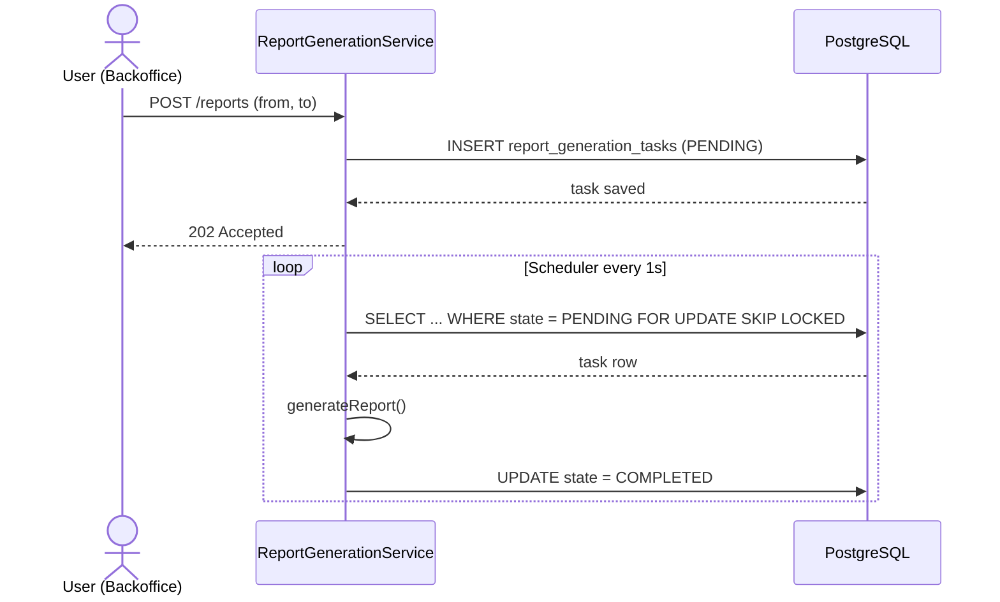
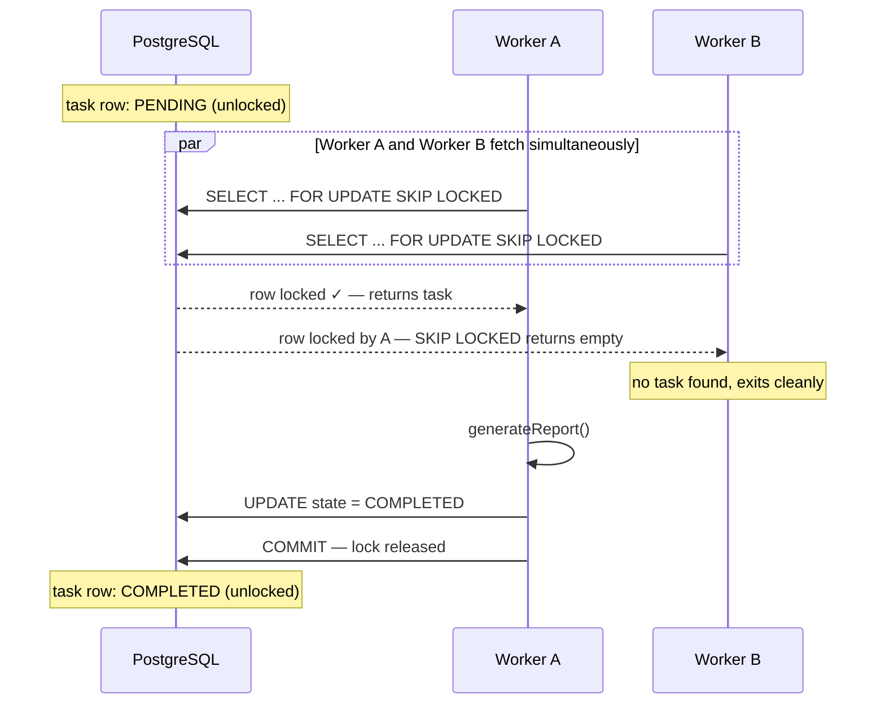
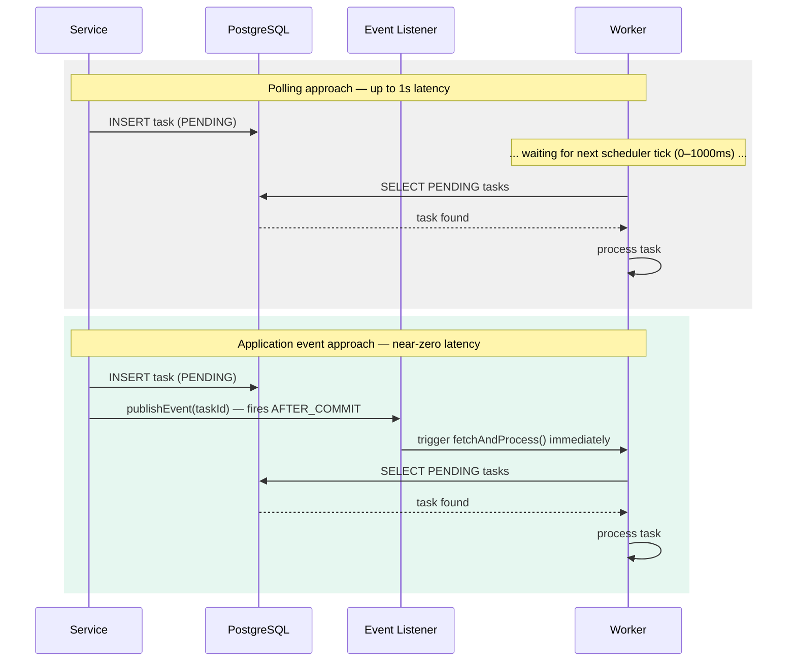
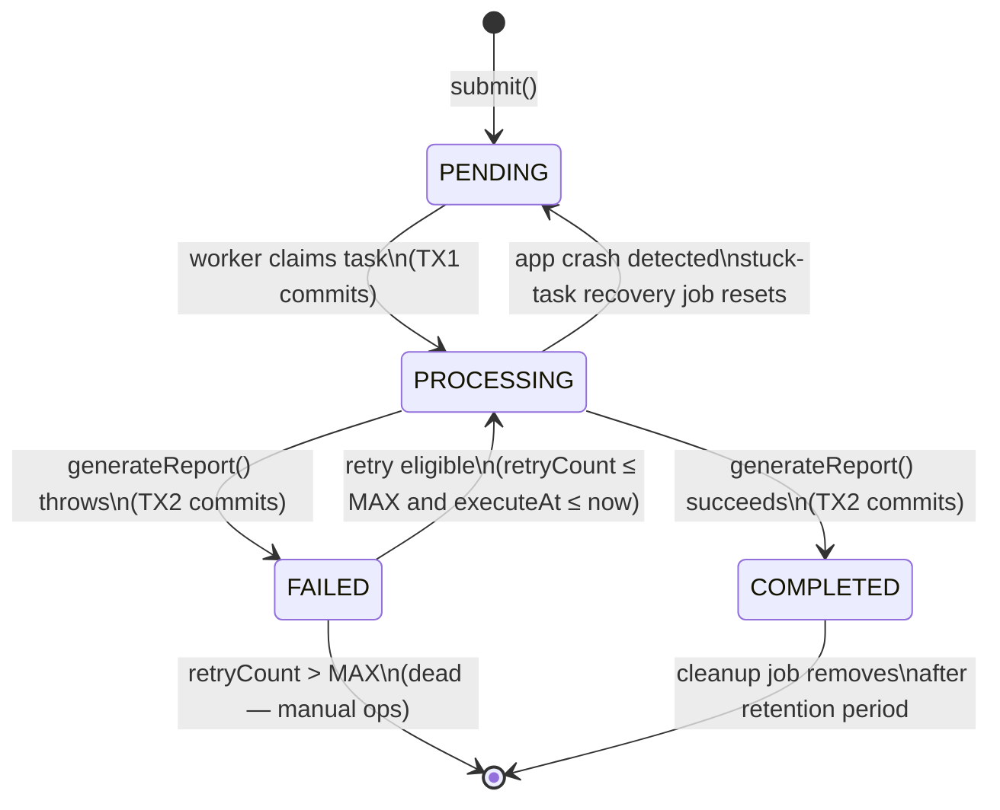
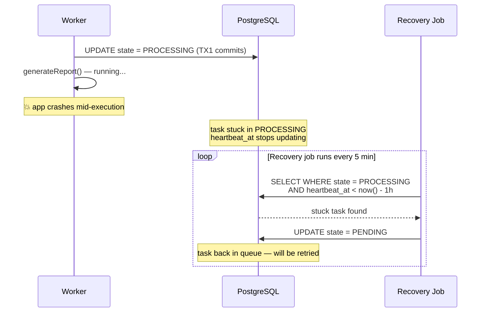
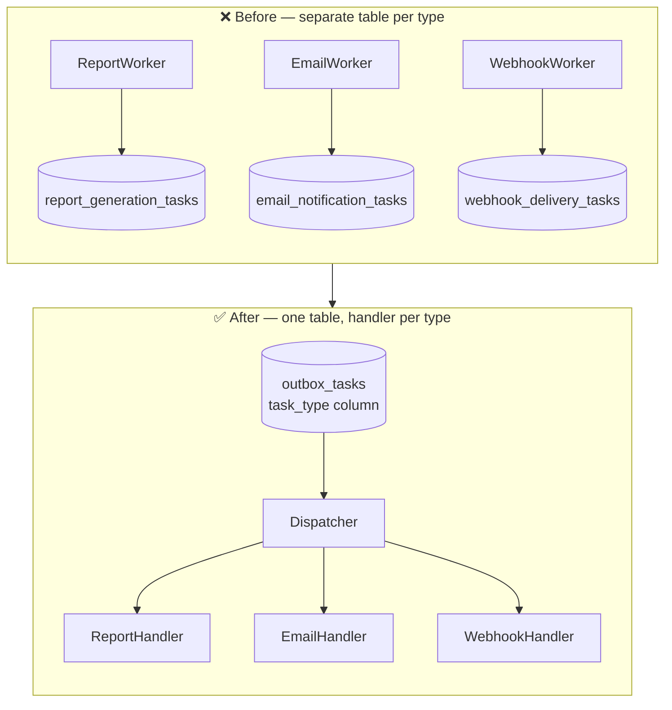

# The Transactional Outbox Pattern: From a Single Task to a Production-Grade Async Engine

There is a class of bugs that never shows up in your unit tests and rarely appears in staging.
It appears in production, at 2am, when your app saves a record to the database, then tries to
call an external service — and one of them fails. One side committed. The other didn't. Nobody
knows until a user complains.

This is the **dual-write problem**, and the Transactional Outbox Pattern is the standard answer
to it. The idea is simple: instead of calling the external system directly, write a task into the
same database transaction as your domain change. A background worker picks it up and executes it.
The write is atomic. The task cannot be lost.

What's less documented is everything that comes after the basic idea — what happens when tasks
fail, when two workers race for the same row, when your app crashes mid-execution, when you have
ten different task types living in one table, and when your stakeholders ask why the queue depth
spiked at 3am last Tuesday.

That's what this article covers.

I'll work through a single concrete scenario — a **report generation service** — and evolve it
step by step from the simplest possible outbox to something I'd be comfortable running in
production. Every code snippet is from a real working repo linked at the end.

Stack: **Java, Spring Boot, PostgreSQL**.

<div class="post-tldr" markdown="1">
<p class="post-tldr-title">TL;DR</p>

- The **Transactional Outbox Pattern** fixes the dual-write problem by writing a task row in the **same DB transaction** as your domain change, then executing it from a background worker.
- Poll the outbox table with `SELECT ... FOR UPDATE SKIP LOCKED` so multiple workers can run concurrently without double-processing.
- Production-grade requires more than the basic idea: a **state machine**, **retries with backoff**, **heartbeats/leases** to recover crashed workers, **ordering** guarantees, and **monitoring** of queue depth.
- You don't need Kafka — **PostgreSQL alone** is enough for reliable async execution.
</div>

---

## The Scenario



We're building a CRM. Users can request monthly analytics reports from a backoffice UI.
Generating a report means aggregating tens of millions of rows — it can take minutes.
Obviously we can't do this synchronously in an HTTP request.

The user clicks a button. The backend accepts the request, saves it, and responds immediately.
A background worker picks up the task, runs the generation, and updates the status when done.

This is the simplest case where an outbox makes sense: work that is genuinely async by nature,
where the user already expects to wait.

---

## Part 1 — The Basic Outbox

### What Every Outbox Needs

At its core, any outbox table needs three things:

- **State** — where is this task in its lifecycle?
- **Payload** — what exactly needs to be executed?
- **Timestamps** — when was it created, when did it last change?

```sql
CREATE TYPE task_state AS ENUM ('PENDING', 'COMPLETED');

CREATE TABLE report_generation_tasks (
                                       id         UUID       PRIMARY KEY DEFAULT gen_random_uuid(),
                                       state      task_state NOT NULL    DEFAULT 'PENDING',
                                       payload    JSONB      NOT NULL,
                                       created_at TIMESTAMP  NOT NULL    DEFAULT now(),
                                       updated_at TIMESTAMP  NOT NULL    DEFAULT now()
);
```

The payload for our use case is a date range:

```java
@Value
@Builder
@Jacksonized
public class ReportGenerationPayload {
  Instant from;
  Instant to;
}
```

The JPA entity:

```java
@Entity
@Table(name = "report_generation_tasks")
@Data
@Builder
@NoArgsConstructor
@AllArgsConstructor
public class ReportGenerationEntity {

    @Id
    @GeneratedValue(strategy = GenerationType.UUID)
    @Column(updatable = false, nullable = false)
    private UUID id;

    @Enumerated(EnumType.STRING)
    @Column(nullable = false, columnDefinition = "task_state")
    private TaskState state;

    @JdbcTypeCode(SqlTypes.JSON)
    @Column(nullable = false, updatable = false, columnDefinition = "jsonb")
    private ReportGenerationPayload payload;

    @CreationTimestamp
    @Column(nullable = false, updatable = false)
    private Instant createdAt;

    @UpdateTimestamp
    @Column(nullable = false)
    private Instant updatedAt;
}
```

Submitting a task:

```java
@Service
@RequiredArgsConstructor
public class ReportGenerationService {

    private final ReportGenerationRepository repository;

    public void submit(ReportGenerationCommand command) {
        repository.save(ReportGenerationEntity.builder()
                .state(TaskState.PENDING)
                .payload(ReportGenerationPayload.builder()
                        .from(command.getFrom())
                        .to(command.getTo())
                        .build())
                .build());
    }
}
```

### The Worker

A scheduled job polls for pending tasks and executes them:

```java
@Component
@RequiredArgsConstructor
public class ReportGenerationScheduledJob {

    private final ReportGenerationTaskService taskService;

    @Scheduled(fixedDelay = 1000)
    public void run() {
        taskService.fetchAndProcess();
    }
}
```

```java
@Service
@RequiredArgsConstructor
public class ReportGenerationTaskService {

    private final ReportGenerationRepository repository;

    public void fetchAndProcess() {
        repository.findFirstByStateOrderByCreatedAt(TaskState.PENDING)
                .ifPresent(task -> {
                    generateReport(task);
                    task.setState(TaskState.COMPLETED);
                    repository.save(task);
                });
    }

    private void generateReport(ReportGenerationEntity task) {
        // actual report generation logic
    }
}
```

```java
public interface ReportGenerationRepository extends JpaRepository<ReportGenerationEntity, UUID> {
    Optional<ReportGenerationEntity> findFirstByStateOrderByCreatedAt(TaskState state);
}
```

This works in a single-instance app with no failures. In the real world, it has two problems:
two workers can claim the same task simultaneously, and tasks can fail without any recovery path.
Let's fix both.

---

## Part 2 — Concurrency: Two Workers, One Task

When two scheduler threads — or two app instances — run the fetch query at the same moment,
both can read the same `PENDING` row and both will try to execute it. The result is duplicate work
at best, corrupted state at worst.

The fix is a database lock taken at fetch time. PostgreSQL's `SELECT ... FOR UPDATE SKIP LOCKED`
is purpose-built for exactly this use case: it locks the row for the current transaction and skips
any rows that are already locked by another transaction, rather than waiting.

```java
public interface ReportGenerationRepository extends JpaRepository<ReportGenerationEntity, UUID> {

    @Lock(LockModeType.PESSIMISTIC_WRITE)
    @QueryHint(name = AvailableSettings.JAKARTA_LOCK_TIMEOUT, value = "-2") // -2 = SKIP_LOCKED
    Optional<ReportGenerationEntity> findFirstByStateOrderByCreatedAt(TaskState state);
}
```

The `SKIP_LOCKED` hint value `-2` is what Hibernate translates to the `SKIP LOCKED` clause.
Since there's no first-class annotation for this, it's worth extracting into a reusable annotation
so you don't scatter the magic number across your repositories:

```java
@Retention(RetentionPolicy.RUNTIME)
@Target({ElementType.METHOD, ElementType.ANNOTATION_TYPE})
@QueryHints(@QueryHint(
    name = AvailableSettings.JAKARTA_LOCK_TIMEOUT,
    value = Timeouts.SKIP_LOCKED_MILLI + ""
))
public @interface SkipLocked {}
```

Much cleaner. Now the repository reads like intent, not plumbing:

```java
@SkipLocked
@Lock(LockModeType.PESSIMISTIC_WRITE)
Optional<ReportGenerationEntity> findFirstByStateOrderByCreatedAt(TaskState state);
```

The lock must be held for the entire duration of processing. That means wrapping the whole
fetch-execute-update cycle in a single transaction:

```java
@Transactional
public void fetchAndProcess() {
    repository.findFirstByStateOrderByCreatedAt(TaskState.PENDING)
            .ifPresent(task -> {
                generateReport(task);
                task.setState(TaskState.COMPLETED);
                repository.save(task);
            });
}
```



This approach is clean and safe. One drawback: the database row stays locked for as long as
`generateReport()` runs. For a fast operation this is fine. For something that takes 30 seconds
or more, long-held locks put pressure on the DB — connection pool exhaustion, lock wait timeouts,
and degraded throughput under load. We'll address this in the next section.

---

## Part 2.5 — Reducing Latency with Application Events

The polling scheduler has an inherent latency floor. If your job fires every second, a task
submitted at `t=0ms` sits `PENDING` until the next tick — up to 1000ms later. For most async
workloads that's acceptable. For cases where you want near-immediate pickup — sending a
transactional email, triggering a webhook — it's not.

The pattern borrowed from Celery: save the outbox entity to the database, then immediately
publish a Spring `ApplicationEvent` carrying the new task's ID. A listener picks it up and
dispatches processing right away, without waiting for the next scheduler tick.



The scheduler still runs as a safety net — it catches anything the event listener missed (app
restart, listener exception, missed event). But the happy path bypasses the polling delay
entirely.

### Implementation

Publish the event inside the service method, after saving:

```java
@Service
@RequiredArgsConstructor
public class ReportGenerationService {

    private final ReportGenerationRepository repository;
    private final ApplicationEventPublisher eventPublisher;

    @Transactional
    public void submit(ReportGenerationCommand command) {
        var entity = repository.save(ReportGenerationEntity.builder()
                .state(TaskState.PENDING)
                .payload(ReportGenerationPayload.builder()
                        .from(command.getFrom())
                        .to(command.getTo())
                        .build())
                .build());

        eventPublisher.publishEvent(new ReportGenerationTaskSubmittedEvent(entity.getId()));
    }
}
```

```java
public record ReportGenerationTaskSubmittedEvent(UUID taskId) {}
```

The listener reacts and triggers processing immediately:

```java
@Component
@RequiredArgsConstructor
public class ReportGenerationTaskEventListener {

    private final ReportGenerationTaskService taskService;

    @TransactionalEventListener(phase = TransactionPhase.AFTER_COMMIT)
    public void onTaskSubmitted(ReportGenerationTaskSubmittedEvent event) {
        taskService.fetchAndProcess();
    }
}
```

### The Classic Mistake

The most common error here is using `@EventListener` instead of
`@TransactionalEventListener(phase = TransactionPhase.AFTER_COMMIT)`.

`@EventListener` fires the moment `publishEvent()` is called — which is **inside the open
transaction**, before the `INSERT` has committed. The listener calls `fetchAndProcess()`,
which queries the database for the task by ID. The row does not exist yet. The task is silently
skipped, the event is lost, and you're left wondering why processing never started — even though
the scheduler eventually picks it up seconds later and everything looks fine in the logs.

```java
// ❌ fires inside the transaction — entity not visible to other connections yet
@EventListener
public void onTaskSubmitted(ReportGenerationTaskSubmittedEvent event) {
    taskService.fetchAndProcess();
}

// ✅ fires after COMMIT — entity is visible, fetch succeeds
@TransactionalEventListener(phase = TransactionPhase.AFTER_COMMIT)
public void onTaskSubmitted(ReportGenerationTaskSubmittedEvent event) {
    taskService.fetchAndProcess();
}
```

`AFTER_COMMIT` guarantees the listener runs only after the transaction that published the event
has fully committed. By that point the row is visible to all connections and the fetch will
find it.

The scheduler remains unchanged — it acts as the recovery mechanism for any tasks the event
listener missed. The two approaches complement each other: events for latency, polling for
reliability.

---

## Part 3 — Failures, Retries, and the PROCESSING State



The problem with the locked-transaction approach is that it holds a database lock for the entire
duration of `generateReport()`. For a report that takes two minutes, that's two minutes of a
locked row — a connection tied up, other DB operations potentially queuing behind it. With
`SKIP LOCKED` workers don't block each other on the lock, but long-running transactions still
put pressure on the connection pool and make the database unhappy under load.

The fix is to separate claiming a task from executing it. Flip the task to `PROCESSING` in a
short transaction, release the lock, then do the actual work outside any transaction. This way
the DB is only touched briefly at the start and briefly at the end — the expensive part happens
in between without holding anything.

First, extend the enum:

```sql
ALTER TYPE task_state ADD VALUE 'PROCESSING';
ALTER TYPE task_state ADD VALUE 'FAILED';

ALTER TABLE report_generation_tasks
    ADD COLUMN retry_count  INTEGER NOT NULL DEFAULT 0,
    ADD COLUMN error_message VARCHAR;
```

`retry_count` tracks how many times execution was attempted. We cap retries at 10 — beyond that,
something is genuinely broken and needs manual intervention. We'll wire alerting around this
later. `error_message` stores the last exception so you know *why* a task is stuck without
digging through logs.

The Java enum grows with it:

```java
public enum TaskState {
    PENDING,
    PROCESSING,
    COMPLETED,
    FAILED
}
```

The service now runs two separate short transactions with the actual work in between:

```java
@RequiredArgsConstructor
public class ReportGenerationTaskService {

    private final ReportGenerationRepository repository;
    private final TransactionTemplate transactionTemplate;

    private static final int MAX_RETRY_COUNT = 10;

    public void fetchAndProcess() {
        transactionTemplate
                .execute(status ->
                        repository.findFirstEligibleTask(
                                List.of(TaskState.PENDING, TaskState.FAILED),
                                MAX_RETRY_COUNT
                        ).map(this::markProcessing))
                .ifPresentOrElse(
                        task -> {
                            try {
                                generateReport(task);
                                markCompleted(task);
                            } catch (Exception e) {
                                markFailed(task, e);
                                log.error("Task {} failed on attempt {}", task.getId(), task.getRetryCount(), e);
                            }
                        },
                        () -> log.debug("No eligible tasks to process")
                );
    }

    private ReportGenerationEntity markProcessing(ReportGenerationEntity task) {
        task.setState(TaskState.PROCESSING);
        return repository.save(task);
    }

    private void markCompleted(ReportGenerationEntity task) {
        task.setState(TaskState.COMPLETED);
        repository.save(task);
    }

    private void markFailed(ReportGenerationEntity task, Exception e) {
        task.setState(TaskState.FAILED);
        task.setRetryCount(task.getRetryCount() + 1);
        task.setErrorMessage(e.getMessage()); // don't skip this — it's the only trace of what went wrong without digging through logs
        repository.save(task);
    }
}
```

The query fetches both `PENDING` and `FAILED` tasks — a failed task with `retryCount < 10` is
just as eligible as a fresh one. Once retry count hits the cap, the task stops being fetched and
sits as a permanent `FAILED` record until someone looks at it. That's intentional — beyond 10
attempts something is genuinely broken and needs eyes on it, not another retry.

```java
@SkipLocked
@Lock(LockModeType.PESSIMISTIC_WRITE)
@Query("""
    SELECT t FROM ReportGenerationEntity t
    WHERE t.state IN :states
      AND t.retryCount <= :maxRetryCount
    ORDER BY t.createdAt ASC
    LIMIT 1
    """)
Optional<ReportGenerationEntity> findFirstEligibleTask(
    @Param("states") List<TaskState> states,
    @Param("maxRetryCount") Integer maxRetryCount
);
```

But wait — should a just-failed task really be picked up again on the very next scheduler tick,
seconds later? If the downstream system is down, hammering it every second makes things worse.
That's what the next section covers.

## Part 4 — Exponential Backoff

Without a delay between retries, a failed task re-enters the queue on the very next scheduler
tick — usually seconds later. If the downstream system is down, you're hammering it at full
polling rate. That's bad for the downstream system and bad for your DB.

The fix is an `execute_at` column: the task is not eligible until this timestamp is in the past.
Fresh tasks get `execute_at = now()` so they're picked up immediately. Failed tasks get
`execute_at = now() + delay`, where the delay grows with each retry.

```sql
ALTER TABLE report_generation_tasks
    ADD COLUMN execute_at TIMESTAMP NOT NULL DEFAULT NOW();
```

The delay schedule drives everything — `MAX_RETRY_COUNT` is derived from it, not declared
separately. This way the two can never drift out of sync:

```java
private static final Map<Integer, Duration> RETRY_DELAYS = Map.of(
    0, Duration.ofMinutes(1),
    1, Duration.ofMinutes(5),
    2, Duration.ofMinutes(15),
    3, Duration.ofMinutes(30),
    4, Duration.ofHours(1),
    5, Duration.ofHours(2),
    6, Duration.ofHours(4),
    7, Duration.ofHours(8),
    8, Duration.ofHours(12),
    9, Duration.ofDays(1)
);

private static final int MAX_RETRY_COUNT = RETRY_DELAYS.size();
```

Add a new entry to `RETRY_DELAYS` and the retry cap automatically updates. No magic number to
keep in sync elsewhere.

In `markFailed()`, capture the *current* retry count before incrementing — that selects the
delay for the *next* attempt:

```java
private void markFailed(ReportGenerationEntity task, Exception e) {
    int currentRetry = task.getRetryCount();
    task.setState(TaskState.FAILED);
    task.setRetryCount(currentRetry + 1);
    task.setErrorMessage(e.getMessage());
    task.setExecuteAt(Instant.now().plus(
            RETRY_DELAYS.getOrDefault(currentRetry, RETRY_DELAYS.get(RETRY_DELAYS.size() - 1))));
    repository.save(task);
}
```

The scheduler keeps running at the same rate. It just skips tasks whose window hasn't opened.
Failed tasks sit quietly until their time comes, then re-enter naturally.

---

## Part 5 — Stuck Tasks and Heartbeats



With the two-transaction approach, consider what happens if the app crashes after marking a task
`PROCESSING` but before marking it `COMPLETED` or `FAILED`. The DB shows `PROCESSING`. Nobody is
processing it. It sits there forever.

The naive fix is a recovery job that finds tasks stuck in `PROCESSING` for too long and resets
them to `PENDING`:

```java
@Transactional
public void recoverStuckTasks() {
    repository.findFirstByStateAndUpdatedAtLessThan(
                    TaskState.PROCESSING,
                    Instant.now().minus(1, ChronoUnit.HOURS))
            .ifPresent(task -> {
                log.warn("Resetting stuck task {} to PENDING", task.getId());
                task.setState(TaskState.PENDING);
                repository.save(task);
            });
}
```

This works for most cases. The problem: `updated_at` changes whenever *anything* changes on the
row — including unrelated state transitions. A task legitimately processing for 55 minutes looks
identical to a crashed task from the `updated_at` perspective.

The cleaner solution is a **heartbeat**: a dedicated column that gets bumped periodically *only
while the task is being actively processed*. The recovery job now checks this column, not
`updated_at`. A task that hasn't heartbeated in the last hour is genuinely stuck.

```sql
ALTER TABLE report_generation_tasks ADD COLUMN heartbeat_at TIMESTAMP;
```

The heartbeat runs on its own thread, inside its own transactions, independent of the processing
logic. The cleanest implementation is a `try-with-resources` — it starts when processing starts
and stops on any exit path:

```java
public abstract class Heartbeat implements AutoCloseable {

    private final ScheduledExecutorService executor;

    protected Heartbeat(Runnable heartbeatFn) {
        executor = Executors.newSingleThreadScheduledExecutor();
        executor.scheduleAtFixedRate(heartbeatFn, 0, 10, TimeUnit.SECONDS);
    }

    @Override
    public void close() {
        executor.shutdownNow();
    }
}
```

```java
public class ReportGenerationTaskHeartbeat extends Heartbeat {

    ReportGenerationTaskHeartbeat(UUID taskId, ReportGenerationRepository repository) {
        super(() -> repository.updateHeartbeatAt(taskId, Instant.now()));
    }
}
```

The repository method carries its own `@Transactional` — no need to wrap the call manually:

```java
@Modifying
@Transactional
@Query("UPDATE ReportGenerationTaskEntity t SET t.heartbeatAt = :now WHERE t.id = :id")
void updateHeartbeatAt(@Param("id") UUID id, @Param("now") Instant now);
```

Wire it via a factory so the service stays clean:

```java
@Component
@RequiredArgsConstructor
public class ReportGenerationTaskHeartbeatFactory {

    private final ReportGenerationRepository repository;

    public Heartbeat start(UUID taskId) {
        return new ReportGenerationTaskHeartbeat(taskId, repository);
    }
}
```

The processing block now looks like this:

```java
public void fetchAndProcess() {
    transactionTemplate
            .execute(status -> repository.findFirstEligibleTask(
                    List.of(TaskState.PENDING, TaskState.FAILED),
                    MAX_RETRY_COUNT
            ).map(this::markProcessing))
            .ifPresentOrElse(
                    task -> {
                        try (var heartbeat = heartbeatFactory.start(task.getId())) {
                            try {
                                generateReport(task);
                                markCompleted(task);
                            } catch (Exception e) {
                                markFailed(task, e);
                                log.error("Task {} failed", task.getId(), e);
                            }
                        }
                    },
                    () -> log.debug("No eligible tasks to process")
            );
}
```

The recovery job uses `heartbeat_at` instead of `updated_at`:

```java
@Modifying
@Transactional
@Query("UPDATE ReportGenerationEntity t SET t.heartbeatAt = :now WHERE t.id = :id")
void updateHeartbeatAt(@Param("id") UUID id, @Param("now") Instant now);

Optional<ReportGenerationEntity> findFirstByStateAndHeartbeatAtLessThan(
        TaskState state, Instant threshold);
```

`updated_at` reflects when the task state last changed. `heartbeat_at` reflects whether the
task is alive right now. Keeping them separate means you can answer both questions without
ambiguity.

---

## Part 6 — Multi-Type Outbox



Six months in, your service handles more than report generation. You need email notifications.
Then data exports. Then webhook deliveries.

You have two options: a separate table per task type, or one shared table with a `task_type`
discriminator. The shared table wins when task types are numerous and you're comfortable
processing them from one place. The infrastructure — retries, heartbeats, backoff, monitoring —
stays in one place. Adding a new task type is just adding a new handler.

The tradeoffs worth knowing upfront:

- A misbehaving new task type can slow down all other types — one bad handler burning retries
  creates backpressure across the whole table.
- Ordering guarantees become harder — more on this below.

### The Schema

```sql
CREATE TYPE outbox_task_type AS ENUM ('REPORT_GENERATION', 'EMAIL_NOTIFICATION');

CREATE TABLE outbox_tasks (
    id            UUID             PRIMARY KEY DEFAULT gen_random_uuid(),
    task_type     outbox_task_type NOT NULL,
    state         task_state       NOT NULL    DEFAULT 'PENDING',
    payload       JSONB            NOT NULL,
    retry_count   INTEGER          NOT NULL    DEFAULT 0,
    error_message VARCHAR,
    execute_at    TIMESTAMPTZ      NOT NULL    DEFAULT NOW(),
    heartbeat_at  TIMESTAMPTZ,
    created_at    TIMESTAMPTZ      NOT NULL    DEFAULT now(),
    updated_at    TIMESTAMPTZ      NOT NULL    DEFAULT now()
);
```

### The Handler Interface

The key extensibility point — one implementation per task type:

```java
public interface OutboxTaskHandler<P> {
    OutboxTaskType getType();
    Class<P> payloadClass();
    void handle(UUID taskId, P payload) throws Exception;
}
```

`taskId` is passed into every handler. You'll see why in the idempotency section.

A concrete handler:

```java
@Component
public class EmailNotificationHandler implements OutboxTaskHandler<EmailNotificationPayload> {

    @Override
    public OutboxTaskType getType() {
        return OutboxTaskType.EMAIL_NOTIFICATION;
    }

    @Override
    public Class<EmailNotificationPayload> payloadClass() {
        return EmailNotificationPayload.class;
    }

    @Override
    public void handle(UUID taskId, EmailNotificationPayload payload) throws Exception {
        log.info("Sending email to {} — task {}", payload.getRecipient(), taskId);
        // call email provider
    }
}
```

### The Dispatcher

The service collects all handler beans at startup, builds a lookup map, and routes each task by
`taskType`:

```java
@Service
@RequiredArgsConstructor
public class OutboxTaskService {

    private final OutboxTaskRepository repository;
    private final ObjectMapper objectMapper;
    private final List<OutboxTaskHandler<?>> handlerList;

    private Map<OutboxTaskType, OutboxTaskHandler<?>> handlers;

    @PostConstruct
    void init() {
        handlers = handlerList.stream()
                .collect(Collectors.toMap(OutboxTaskHandler::getType, Function.identity()));
    }

    @SuppressWarnings("unchecked")
    private void dispatch(OutboxTaskEntity task) throws Exception {
        var handler = (OutboxTaskHandler<Object>) handlers.get(task.getTaskType());
        if (handler == null) {
            throw new IllegalStateException(
                    "No handler registered for task type: " + task.getTaskType());
        }
        var payload = objectMapper.readValue(task.getPayload(), handler.payloadClass());
        handler.handle(task.getId(), payload);
    }
}
```

Registering a new task type is: add enum value, add handler bean, done. The dispatcher, the
scheduler, the retry logic — none of it changes.

---

## Part 7 — Ordering

If your use case doesn't care about processing order — fire-and-forget notifications, independent
background jobs — skip this section. But even then, fetching earlier-inserted tasks first is the
more honest behaviour: tasks submitted first have been waiting longer, and processing them in
submission order is what users would reasonably expect.

Without an explicit `ORDER BY`, PostgreSQL makes **no guarantee** about row return order. Always
sort by `created_at ASC` in your fetch query:

```java
@Query("""
    SELECT t FROM OutboxTaskEntity t
    WHERE t.state IN :states
      AND t.retryCount <= :maxRetryCount
      AND t.executeAt <= :now
    ORDER BY t.createdAt ASC
    LIMIT 1
    """)
Optional<OutboxTaskEntity> findFirstEligibleTask(...);
```

Back this with a partial index:

```sql
CREATE INDEX idx_outbox_fetch
    ON outbox_tasks (created_at ASC)
    WHERE state IN ('PENDING', 'FAILED');
```

### The Clock Skew Trap

First, be honest about whether this matters for your use case. If your tasks are independent —
report generation, email sending, webhook delivery — processing order usually doesn't matter at
all. Task A finishing before task B is fine regardless of which was submitted first. In that case
this whole section is not your problem.

If you do need FIFO — tasks for the same entity that must be processed in submission order —
then read on.

The issue is that `created_at` is generated on the application side. Each app instance has its
own system clock. If instance A is 200ms ahead of instance B, a task submitted by B at `t=100ms`
gets a `created_at` that is earlier than a task submitted by A at `t=50ms` — even though A's
task was inserted first. The fetch query sorts by `created_at` and picks up B's task first.
Submission order is inverted.

NTP keeps clocks close but not perfectly synchronized. Under normal conditions the drift is
milliseconds. Under load, during VM migrations, or after a container restart, it can be more.

The fix is to generate the ordering value on the database side — either let PostgreSQL assign
`created_at` via `DEFAULT now()` rather than letting the application set it, or use a
database-backed sequence which is guaranteed monotonically increasing regardless of which
instance inserted the row. Here's the sequence approach:

```sql
ALTER TABLE outbox_tasks ADD COLUMN seq BIGSERIAL;
```

```java
@Column(insertable = false, updatable = false)
private Long seq;
```

Sort by `seq ASC`. The value is assigned by a single authoritative source — the database — so
it reflects true insertion order regardless of which instance submitted the task or what that
instance's clock said.

Keep `created_at` for observability. Use `seq` for ordering.

If strict FIFO matters in your system — don't forget this.

---

## Part 8 — Indexes That Keep the Table Fast at Scale

Your outbox table is polled every second, often multiple times per second. Every row in it is
either active work (`PENDING`, `FAILED`, `PROCESSING`) or historical noise (`COMPLETED`). Without the
right indexes, each poll scans the entire table to find the handful of eligible rows.

The right tool is a **partial index** — one that only includes rows matching a predicate. When a
task transitions to `COMPLETED`, it falls out of the partial index automatically. The index stays
small forever, regardless of how many tasks the table has ever processed.

### The Fetch Index — the hot path

Index for the fetch query:

```sql
CREATE INDEX idx_outbox_fetch
    ON outbox_tasks (created_at ASC)
    WHERE state IN ('PENDING', 'FAILED');
```

To test it: inserted 50,000 rows with only 7 in `PENDING` state, enabled Hibernate SQL debug
logging to get the exact generated query in the console, ran `EXPLAIN ANALYZE` over that SQL:

```
Limit  (cost=0.14..27.50 rows=1 width=102) (actual time=0.082..0.084 rows=1 loops=1)
  ->  LockRows  (actual time=0.081..0.082 rows=1 loops=1)
        ->  Index Scan using idx_outbox_fetch on outbox_tasks
              (actual time=0.030..0.030 rows=1 loops=1)
Planning Time: 1.230 ms
Execution Time: 0.139 ms
```

0.03ms to find the oldest eligible task. The 49,993 `COMPLETED` rows were never read. Looks good to me.

Two more indexes for the other two background operations:

For the recovery job:

```sql
CREATE INDEX idx_outbox_stuck
    ON outbox_tasks (heartbeat_at ASC, created_at ASC)
    WHERE state = 'PROCESSING';
```

For the cleanup job:

```sql
CREATE INDEX idx_outbox_cleanup
    ON outbox_tasks (updated_at ASC)
    WHERE state = 'COMPLETED';
```

---

## Part 9 — Cleanup

Your outbox is an operational table. Every fetch query scans it. Old rows are dead weight.

The rule: only delete **`COMPLETED`** tasks. `FAILED` tasks are your audit trail. Leave them alone.
Handle them manually or via a separate ops process when needed.

```java
@Modifying
@Transactional
@Query("""
    DELETE FROM OutboxTaskEntity t
    WHERE t.state IN :states
      AND t.updatedAt < :before
    """)
int deleteByStateInAndUpdatedAtBefore(
    @Param("states") List<TaskState> states,
    @Param("before") Instant before
);
```

```java
private static final int CLEANUP_RETENTION_DAYS = 30;

@Transactional
public void cleanup() {
    var cutoff = Instant.now().minus(CLEANUP_RETENTION_DAYS, ChronoUnit.DAYS);
    int deleted = repository.deleteByStateInAndUpdatedAtBefore(
            List.of(TaskState.COMPLETED), cutoff);
    log.info("Cleanup: removed {} completed tasks older than {} days", deleted, CLEANUP_RETENTION_DAYS);
}
```

How long to retain: I've seen everything from 1 day to 3 months. If you're unsure — keep longer.
The cost of retaining old rows is a slightly larger table. The cost of deleting them too early
is losing your debugging history on the day you need it most.

---

## Part 10 — Idempotency: Making Retries Safe

Nothing in this architecture guarantees exactly-once execution. The task runs and the state
update to `COMPLETED` are two separate operations. If the app crashes after execution but before
the state update commits, the task will be retried. It will run again with the same inputs.

This is **at-least-once** delivery — it's the only guarantee available here. The question is
whether a duplicate execution causes harm.

If your task is inherently idempotent (generating the same report twice produces the same report),
you're done. If it has side effects (sends an email, charges a card), a duplicate is a problem.

The fix: use the outbox task's own `id` as an idempotency key inside the handler. The task ID is
stable across retries — it never changes for the same row. The handler checks whether work for
this ID was already recorded. If yes, it's a no-op.

In our case, report generation ends by inserting a row into `generated_reports` — that's the
record of work done. We add a `UNIQUE` constraint on `idempotency_key` so that even if two
instances race, only one INSERT wins. The other gets a constraint violation and treats it as a
successful no-op:

```sql
CREATE TABLE generated_reports (
    id               UUID        PRIMARY KEY DEFAULT gen_random_uuid(),
    idempotency_key  UUID        NOT NULL,
    report_path      VARCHAR     NOT NULL,
    created_at       TIMESTAMPTZ NOT NULL    DEFAULT now(),

    CONSTRAINT uq_generated_reports_idempotency_key UNIQUE (idempotency_key)
);
```

```java
@Component
@RequiredArgsConstructor
public class ReportGenerationHandler implements OutboxTaskHandler<ReportGenerationPayload> {

    private final GeneratedReportRepository reports;

    @Override
    public void handle(UUID taskId, ReportGenerationPayload payload) {
        if (reports.existsByIdempotencyKey(taskId)) {
            log.info("Report already generated for task {} — skipping", taskId);
            return;
        }

        var reportPath = runReportGeneration(payload);

        reports.save(GeneratedReport.builder()
                .idempotencyKey(taskId)
                .reportPath(reportPath)
                .build());
    }
}
```

If your task calls an external API instead of writing to the DB, check whether that API supports
idempotency keys — most payment processors and transactional email providers do. Pass the outbox
task ID as the idempotency key in whatever form the API requires (header, body field, query param).
The remote service handles deduplication on their end.

---

## Part 11 — Monitoring

The outbox runs silently in the background. When it works, nobody notices. When it breaks,
nobody notices that either — at least not immediately. Stuck tasks pile up. Downstream services
stop receiving events. By the time someone looks at logs it's been two hours.

Three signals cover the failure space completely, per the Google SRE model:

- **Latency** — how long does each task take from pick-up to completion? Spike here means the handler is slow or the DB is under pressure.
- **Throughput** — how many tasks per unit time are finishing? Drops to zero means the scheduler isn't running or no tasks are being claimed.
- **Error rate** — what fraction of attempts end in failure? Above ~5% means a downstream dependency is degraded and the retry backlog is growing.


### Instrumentation

Add to `build.gradle.kts`:

```kotlin
implementation("org.springframework.boot:spring-boot-starter-actuator")
implementation("io.micrometer:micrometer-registry-prometheus")
```

Register the `@Timed` AOP aspect once:

```java
@Bean
public TimedAspect timedAspect(MeterRegistry registry) {
    return new TimedAspect(registry);
}
```

Keep metric names as constants and increment from a dedicated component — not scattered across
service methods:

```java
@Component
@RequiredArgsConstructor
public class OutboxMetrics {

  private static final String TASK_PROCESSED = "outbox.task.processed";
  private static final String OUTCOME_TAG    = "outcome";
  private static final String COMPLETED      = "completed";
  private static final String FAILED         = "failed";

  private final MeterRegistry meterRegistry;
  private final ReportGenerationRepository repository;

  public void recordCompleted() {
    meterRegistry.counter(TASK_PROCESSED, OUTCOME_TAG, COMPLETED).increment();
  }

  public void recordFailed() {
    meterRegistry.counter(TASK_PROCESSED, OUTCOME_TAG, FAILED).increment();
  }

  @PostConstruct
  void registerGauge() {
    Gauge.builder("outbox.tasks.pending", repository,
                    repo -> repo.countByStateIn(List.of(TaskState.PENDING, TaskState.FAILED)))
            .description("Tasks waiting to be processed")
            .register(meterRegistry);
  }
}
```

The service then just calls `metrics.recordCompleted()` and `metrics.recordFailed()` — no raw
strings in business logic.

After startup, `curl localhost:8080/actuator/prometheus | grep outbox` gives you:

```
outbox_task_duration_seconds{quantile="0.5"}  0.062
outbox_task_duration_seconds{quantile="0.95"} 0.145
outbox_task_duration_seconds{quantile="0.99"} 0.312
outbox_task_processed_total{outcome="completed"} 40.0
outbox_task_processed_total{outcome="failed"}    2.0
outbox_tasks_pending 0.0
```

### Alerts

Dashboards are for humans watching screens. Alerts are for humans who are asleep.

| Alert | Fires when | For | Meaning |
|---|---|---|---|
| `OutboxQueueBacklog` | pending > 50 | 5m | Processing can't keep up with ingest |
| `OutboxHighErrorRate` | error rate > 5% | 2m | Handler or downstream degraded |
| `OutboxSlowProcessing` | p99 latency > 30s | 5m | DB contention or slow external call |
| `OutboxStuckTasks` | pending > 0 and zero completions in 10m | 10m | Scheduler crashed or all workers stuck |

Tune thresholds to your own load. A queue depth of 50 may be normal for a high-throughput
service. For a low-volume internal tool, even 5 tasks sitting for 5 minutes warrants a look.
The signal logic is the same; only the numbers change.

---

## Production Checklist

Before shipping any outbox to production:

```
☐ Indexes are efficient — partial indexes on PENDING/FAILED and PROCESSING states
☐ EXPLAIN ANALYZE confirms index usage on the fetch query
☐ Ordering is not a problem — ORDER BY seq or created_at, backed by index
☐ Processed data cleanup job running, COMPLETED rows removed after retention period
☐ Idempotency handled inside handlers with side effects
☐ Exponential backoff wired — or confirmed not needed for this use case
☐ Metrics in place — queue depth, throughput, error rate, latency
☐ Alerts configured — backlog, error rate, latency, stuck tasks
```

---

## The Ecosystem — You Don't Always Have to Build This

Everything described in this article is something you can build yourself — and there is real
value in doing so at least once. You understand the failure modes, the index choices, the
ordering traps, because you designed around them. That knowledge doesn't go away when you switch
to a library.

But in production, you often don't need to maintain this yourself.

---

**[db-scheduler](https://github.com/kagkarlsson/db-scheduler)** — Gustav Karlsson's
persistent cluster-friendly scheduler for Java. This is the library I keep coming back to and
the one whose internals most closely match what we built in this article. It uses a single
database table, pessimistic locking with `SKIP LOCKED`, heartbeats to detect stuck tasks, and
a clean task/handler interface. When I design self-rolled outboxes, I use db-scheduler as the
reference implementation — the interfaces, the patterns, the failure handling are all sound. If
you're starting a new project and want a battle-tested foundation rather than rolling your own,
start here. The abstractions are thin enough that you'll recognize everything from this article
in the source code.

---

**[Celery](https://docs.celeryq.dev/)** — the de-facto standard for async task execution in
the Python ecosystem. Celery supports PostgreSQL as a result backend and Redis or RabbitMQ as a
broker. The `AFTER_COMMIT` pattern from Part 2.5 applies here too — push to Celery only after
the transaction commits, not inside it.

---

**[Quartz Scheduler](https://www.quartz-scheduler.org/)** — the long-standing Java scheduling
library with JDBC-backed job persistence. More general than an outbox, with cron expressions,
triggers, and job stores. The operational overhead is higher than db-scheduler and the API is
verbose by modern standards, but it's proven at scale with first-class Spring integration via
`spring-boot-starter-quartz`.

---

## Final Thoughts

Most of what's in this article isn't clever engineering — it's accumulated scar tissue. The
`PROCESSING` state exists because someone's app crashed. The heartbeat exists because
`updated_at` lied. The partial index exists because a full table scan at polling frequency
compounds quietly until it doesn't. The `AFTER_COMMIT` listener exists because someone published
an event inside a transaction and spent hours debugging why it never fired.

Each piece is boring on its own. Together they make the difference between an outbox that works
in development and one you can trust at 3am.

---

## Code

Code from this article is available at **[github.com/javaAndScriptDeveloper/outboxes-article](https://github.com/javaAndScriptDeveloper/outboxes-article)**. Everything runs locally with a single command.

---

## Let's Talk

If you hit something I missed, or you've solved one of these problems differently in your own
systems — I'd genuinely like to hear it. Contact links are in the footer.